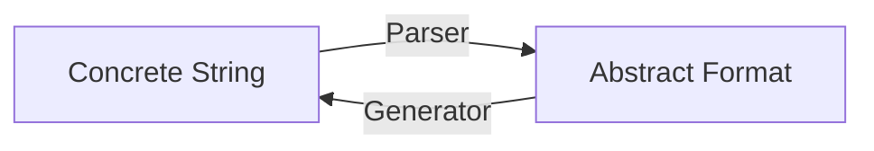

# Cryptographic Protocols Modeling & Verification

[TOC]


## Res
### Related Topics
↗ [Cryptology & Secure Communication](../../../../../../../🚬%20Cryptology%20&%20Secure%20Communication/Cryptology%20&%20Secure%20Communication.md)
- ↗ [Cryptography](../../../../../../../🚬%20Cryptology%20&%20Secure%20Communication/🤐%20Cryptography/Cryptography.md)
- ↗ [Cryptographic Protocols Modeling & Models of Communication (and Intruder)](../../../../🚬%20Cryptology%20&%20Secure%20Communication/🛀%20Cryptographic%20Protocols%20Modeling%20&%20Models%20of%20Communication%20(and%20Intruder)/Cryptographic%20Protocols%20Modeling%20&%20Models%20of%20Communication%20(and%20Intruder).md)

↗ [AnB (Alice and Bob) Notation & AnBx Languages](../../../../../🔑%20CS%20Core/👩‍💻%20Computer%20Languages%20&%20Programming%20Methodology/Other%20Languages%20for%20Specific%20Areas/Formal%20Verification%20&%20Analysis%20Programming%20Languages/AnB%20(Alice%20and%20Bob)%20Notation%20&%20AnBx%20Languages.md)


### Learning Resources
https://paolo.science/anbxtutorial/tools/OFMC-tutorial.pdf (March 2020)
https://www.imm.dtu.dk/~samo/OFMC-tutorial.pdf# (Spring 2018)
Protocol Security Verification Tutorial
Sebastian M ̈odersheim,
DTU Compute, samo@dtu.dkSpring 2018
- This tutorial gives an introduction to modeling security protocols and the methods for automated verification that is hopefully easier accessible than research papers. For concreteness it uses OFMC, an automated protocol verification tool written by the author, and thus this document also serves as a user manual for OFMC. Several other methods and tools are briefly discussed in order to give a broader perspective.
- OFMC [Manual](https://paolo.science/anbxtutorial/tools/ofmc-manual.pdf) and [Tutorial](https://paolo.science/anbxtutorial/tools/OFMC-tutorial.pdf) (S.Mödersheim)

https://archiv.infsec.ethz.ch/education/as09/fmsec.html
Formal Methods for Information Security
[263-4600-00L](http://www.vvz.ethz.ch/Vorlesungsverzeichnis/lerneinheitPre.do?lerneinheitId=63189&semkez=2009W&lang=en) (2V + 1U) Autumn Semester 2009
**Lecturers and Tutors:** [Sebastian Mödersheim](http://www.zurich.ibm.com/~smo/) and [Christoph Sprenger](https://archiv.infsec.ethz.ch/people/csprenge.html)
- The lecture treats formal and cryptographic methods for the modelling and analysis of security-critical systems. The first and main part of the lecture will concentrate on cryptographic protocols. Cryptographic protocols such as SSL/TLS, SSH, Kerberos and IPSec, form the basis for secure communication and business processes. Numerous attacks on published protocols, such as public-key Kerberos, show that the design of these protocols is extremely error-prone. A rigorous analysis of these protocols is therefore indispensable. Besides an overview of existing analysis methods and tools the lecture will convey the theoretical basis and functioning of some selected methods and tools. The tutorials offer the possibility of applying some tools on concrete protocols. The second part of the lecture will be concerned with formal methods in other parts of information security such as access control.

Colin Boyd and Anish Mathuria. Protocols for Authentication and Key Establishment, Springer, 2003.


### Other Resources
https://arxiv.org/pdf/1101.1815
Approaches to Formal Verification of Security Protocols
Suvansh Lal, Mohit Jain, Vikrant Chaplot
Dhirubhai Ambani Institute of Information and Communication Technology
- To achieve our objective we introduce four well known verification approaches – 1) the **sequential programming** approach; 2 )the **logic programming** approach; 3) the **strand spaces** approach and the 4) **belief based** approach – falling under the broader domains of **model checking** and **logical inference**. Each of the above mention methodologies are applied to formally verify the Needham Schroeder Public Key protocol [3] for Lowe’s attack[4]. In the process of doing so, we compare these approaches for their specification ease, competence in determining complex security flaws; and computational costs. We also make an explicit mention of the advantages and limitations of using these approaches in verifying similar systems.

https://www.ercim.eu/publication/Ercim_News/enw64/armando.html
AVISPA: Automated Validation of Internet Security Protocols and Applications
by Alessandro Armando, David Basin, Jorge Cuellar, Michael Rusinowitch and Luca Viganò
- AVISPA is a push-button tool for the Automated Validation of Internet Security Protocols and Applications. It provides a modular and expressive formal language for specifying protocols and their security properties, and integrates different back-ends that implement a variety of state-of-the-art automatic analysis techniques. Experimental results, carried out on a large library of Internet security protocols, indicate that the AVISPA tool is the state of the art for automatic security protocols. No other tool combines the same scope and robustness with such performance and scalability.


## Intro
> [!links]
> ↗ [(Formal) Model Checking](../../🧳%20(Formal)%20Model%20Checking/(Formal)%20Model%20Checking.md)
> ↗ [Constraint Solving & Theorem Proving](../../🎮%20Constraint%20Solving%20&%20Theorem%20Proving/Constraint%20Solving%20&%20Theorem%20Proving.md)
> 
> ↗ [Problem Solving & Search-Based Methods](../../../../../🧠%20Computing%20Methodologies/👽%20Artificial%20Intelligence/🗝️%20AI%20Basics%20&%20Major%20Techniques/Problem%20Solving%20&%20Search-Based%20Methods/Problem%20Solving%20&%20Search-Based%20Methods.md)
> ↗ [Constraint Based Search & Constraint Programming & Constraint Satisfaction](../../../../../🧠%20Computing%20Methodologies/👽%20Artificial%20Intelligence/🗝️%20AI%20Basics%20&%20Major%20Techniques/Problem%20Solving%20&%20Search-Based%20Methods/Constraint%20Based%20Search%20&%20Constraint%20Programming%20&%20Constraint%20Satisfaction/Constraint%20Based%20Search%20&%20Constraint%20Programming%20&%20Constraint%20Satisfaction.md)
> 
> ↗ [Formal Verification & Analysis Programming Languages](../../../../../../../../🔑%20CS%20Core/👩‍💻%20Computer%20Languages%20&%20Programming%20Methodology/Other%20Languages%20for%20Specific%20Areas/Formal%20Verification%20&%20Analysis%20Programming%20Languages/Formal%20Verification%20&%20Analysis%20Programming%20Languages.md)
> - ↗ [AnB (Alice and Bob) Notation & AnBx Languages](../../../../../🔑%20CS%20Core/👩‍💻%20Computer%20Languages%20&%20Programming%20Methodology/Other%20Languages%20for%20Specific%20Areas/Formal%20Verification%20&%20Analysis%20Programming%20Languages/AnB%20(Alice%20and%20Bob)%20Notation%20&%20AnBx%20Languages.md)
> 
> ↗ [Cryptographic Protocols Modeling & Models of Communication (and Intruder)](../../../../🚬%20Cryptology%20&%20Secure%20Communication/🛀%20Cryptographic%20Protocols%20Modeling%20&%20Models%20of%20Communication%20(and%20Intruder)/Cryptographic%20Protocols%20Modeling%20&%20Models%20of%20Communication%20(and%20Intruder).md)

 >[!quote]
 >https://paolo.science/anbxtutorial/tools/OFMC-tutorial.pdf (March 2020)
 >Protocol Security Verification Tutorial
 >Sebastian M ̈odersheim,
 >
 >This tutorial gives an introduction to modeling security protocols and the methods for automated verification that is hopefully easier accessible than research papers. For concreteness it uses OFMC, an automated protocol verification tool written by the author, and thus this document also serves as a tutorial for OFMC. Several other methods and tools are briefly discussed in order to give a broader perspective.
 >
 >In the first part, we will entirely focus on **precisely describing security protocols**, their security goals and a model of the intruder, so that “the protocol is secure” is a **mathematical statement** that is either true or false, and there is a chance to prove or disprove this statement. Disprove also entails finding a **counter-example** to security: an attack.
 >
 >The second part is concerned with methods to automatically find the correct answer, i.e., to find a proof of security or an attack. This is difficult since in general there will be an infinite number of things that can happen in a protocol, so that exhaustive search is impossible. Even under reasonable restrictions that make the search space finite, this is often still practically infeasible. We will focus on two techniques that can in practice often deal well with protocol security problems. One is based on **symbolic representation with constraints** and it can often find attacks quickly; the other is based on **abstract interpretation** and it can often find proofs of security. We will also discuss why the problem is in general undecidable, i.e., there is no hope for finding any verification method that will always answer correctly for all protocols.
 >
 >In the third part, two more advanced topics, namely **channels** and **compositionality**. The idea is that on the Internet we use a lot of protocols in parallel and in a stacked fashion, e.g., using TLS to establish a secure channel and run a banking application over that channel. While one could theoretically verify such a composed system, this becomes easily too complex to handle. Also, we would like protocol designers to design a protocol like TLS independent of the actually payload protocols that it will be used for later. The key of compositional reasoning is to just allow this component-wise development, i.e., that the composed system is secure if the components are.


### (Cryptographic) Protocol Security Overview
“Logical Hacking” and Security Proofs
- What is an “attack”? (and what is not?)
- How can we automatically find attacks?
- How can we prove the security of a system?
	- ... not just with respect to currently known attacks, but against any attacks!
	- Is that even possible?
	- Can we do that even automatically?
- How can we build systems that are secure? 
	- This requires a precise definitions of
		- the systems in questions
		- its goals
		- the assumptions (in particular, the intruder)

Overview of Problem Areas
- Example: Alice wants to tell her bank to transfer 1000 Kr. to Bob.
	- What are the involved goals?
		- Authentication/Integrity
		- Confidentiality/Privacy
		- Accountability/Non-repudiation
	- Involved Cryptographic Protocols: (could be)
		- TLS
		- The banking application
		- Some login like MitID (also over TLS? Same session?)
	- Implementation
		- Crypto API
		- All the non-crypto aspects, like parsing message formats.
	- Other layers
		- Design and implementation of policies
		- Operating system, compiler
		- Hardware, TPMs
		- Network layer


## 1️⃣ Security Protocols Modeling & Intruder Models
↗ [Cryptographic Protocols Modeling & Verification](Cryptographic%20Protocols%20Modeling%20&%20Verification.md)

↗ [Cryptology & Secure Communication](../../../../../../🚬%20Cryptology%20&%20Secure%20Communication/Cryptology%20&%20Secure%20Communication.md)
- ↗ [Cryptography](../../../../../../🚬%20Cryptology%20&%20Secure%20Communication/🤐%20Cryptography/Cryptography.md)
- ↗ [Cryptographic Protocols Modeling & Models of Communication (and Intruder)](../../../../🚬%20Cryptology%20&%20Secure%20Communication/🛀%20Cryptographic%20Protocols%20Modeling%20&%20Models%20of%20Communication%20(and%20Intruder)/Cryptographic%20Protocols%20Modeling%20&%20Models%20of%20Communication%20(and%20Intruder).md) ✅
	- ↗ [Dolev–Yao (DY) Model & Extended Dolev–Yao Models](../../../../🚬%20Cryptology%20&%20Secure%20Communication/🛀%20Cryptographic%20Protocols%20Modeling%20&%20Models%20of%20Communication%20(and%20Intruder)/Symbolic%20(Formal)%20Models/Dolev–Yao%20(DY)%20Model%20&%20Extended%20Dolev–Yao%20Models.md)

↗ [Term Algebra & Free Algebra](../../../../../../../🧮%20Mathematics/🧊%20Algebra/🎃%20Algebraic%20Structure%20&%20Abstract%20Algebra%20&%20Modern%20Algebra/👽%20Universal%20Algebra%20(泛代数)/Term%20Algebra%20&%20Free%20Algebra.md)


### Alice and Bob Notation & AnB Language (Syntax & Semantics) ⭐
↗ [Formal Verification & Analysis Programming Languages](../../../../../../../🔑%20CS%20Core/👩‍💻%20Computer%20Languages%20&%20Programming%20Methodology/Other%20Languages%20for%20Specific%20Areas/Formal%20Verification%20&%20Analysis%20Programming%20Languages/Formal%20Verification%20&%20Analysis%20Programming%20Languages.md)
- ↗ [AnB (Alice and Bob) Notation & AnBx Languages](../../../../../🔑%20CS%20Core/👩‍💻%20Computer%20Languages%20&%20Programming%20Methodology/Other%20Languages%20for%20Specific%20Areas/Formal%20Verification%20&%20Analysis%20Programming%20Languages/AnB%20(Alice%20and%20Bob)%20Notation%20&%20AnBx%20Languages.md)

↗ [Strand Spaces Model](../../../../🚬%20Cryptology%20&%20Secure%20Communication/🛀%20Cryptographic%20Protocols%20Modeling%20&%20Models%20of%20Communication%20(and%20Intruder)/Symbolic%20(Formal)%20Models/Strand%20Spaces%20Model.md)

----
 >https://paolo.science/anbxtutorial/tools/OFMC-tutorial.pdf (March 2020)
 >Protocol Security Verification Tutorial
 >Sebastian M ̈odersheim,
 >Chapter 6.

> [!definition]
> **Signature**
> 
> A signature $Σ$ is a set of function symbols.
> Constants are a special case of functions: they take 0 arguments.
> 
> **Table 1:** Standard function symbols for protocol verification.
> 
> | Symbol                            | Arity   | Meaning (informal)                    | Public    |
> | --------------------------------- | ------- | ------------------------------------- | --------- |
> | $i$                               | $0$     | name of the intruder                  | yes       |
> | $\operatorname{inv}(\cdot)$       | $1$     | private key of a given public key     | no        |
> | $\{\cdot\}_{\cdot}$               | $2$     | asymmetric encryption                 | yes       |
> | $\{\cdot\}_{\cdot}$               | $2$     | symmetric encryption                  | yes       |
> | $\langle \cdot,\cdot \rangle$     | $2$     | pairing/concatenation                 | yes       |
> | $\operatorname{exp}(\cdot,\cdot)$ | $2$     | exponentiation modulo fixed prime $p$ | yes       |
> | $a,b,c,\ldots$                    | $0$     | User-defined constants                | User-def. |
> | $f(\cdot)$                        | $\star$ | User-defined function symbol $f$      | User-def. |
> - Call $Σ$ the set of all function symbols and $Σ_p$ the public ones.
> - Public functions can be applied by every agent
> - $\operatorname{inv}$ is not public: the private key of a given public key.

> [!definition]
> **Terms**
> 
> Let $V=\{X,Y,Z,\ldots\}$ be a set of variable symbols.  
> $\mathcal{T}_{\Sigma}(V)$ is the set of *terms* (over $\Sigma$ and $V$), defined as follows:
> - All variables of $V$ are terms.
> - If $f\in\Sigma$ is a function symbol that takes $n$ arguments and if $t_1,\ldots,t_n$ are terms, then also $f(t_1,\ldots,t_n)$ is a term.

> [!example]
> ↗ [Needham–Schroeder Protocol](../../../../🚬%20Cryptology%20&%20Secure%20Communication/Key%20Management/📌%20Key%20Management%20Algorithms%20&%20Protocols/👥%20Key%20Agreement,%20Transport,%20and%20Exchange%20(one-to-one)/Key%20Transport%20Algorithms%20&%20Protocols/Needham–Schroeder%20Protocol.md)
> NSPK protocol expressed as in AnB language, message sequence chart, and Role /Strand
> 
> ==AnB language:==
> ```AnB
> Protocol : NSPK
> Types : Agent A , B ;
> 		Number NA , NB ;
> 		Function pk , h
> Knowledge : A : B : A , pk ( A ) , inv ( pk ( A )) , B , pk ( B ) , h ;
> 			B , pk ( B ) , inv ( pk ( B )) , A , pk ( A ) , h
> Actions :
> A - > B : { NA , A }( pk ( B ))  # A generates NA
> B - > A : { NA , NB }( pk ( A )) # B generates NB
> A - > B : { NB }( pk ( B ))
> 
> Goals :
> h(NA, NB) secret between A , B
> ```
> 
> ==Message sequence chart:==
> ```tikz
> \begin{document}
> \begin{tikzpicture}[
>   font=\Large,
>   linebase/.style={line width=1.2pt},
>   dot/.style={circle, fill=black, inner sep=0pt, minimum size=7pt},
>   lab/.style={midway, above, inner sep=3pt}
> ]
> % \tikzset{>=stealth'} % bigger arrowheads
> % this is not working in obsidian tikz?
> 
> % X positions
> \def\xA{0}
> \def\xB{10}
> \def\d{0.18}
> 
> % Y positions
> \def\yTop{6.5}
> \def\yOne{4.5}
> \def\yTwo{2.2}
> \def\yThree{-0.1}
> 
> % Participant boxes
> \node[draw, minimum width=12mm, minimum height=12mm] at (\xA,\yTop) {\textit{A}};
> \node[draw, minimum width=12mm, minimum height=12mm] at (\xB,\yTop) {\textit{B}};
> 
> % Dots
> \node[dot] (A1) at (\xA,\yOne) {};
> \node[dot] (A2) at (\xA,\yTwo) {};
> \node[dot] (A3) at (\xA,\yThree) {};
> 
> \node[dot] (B1) at (\xB,\yOne) {};
> \node[dot] (B2) at (\xB,\yTwo) {};
> \node[dot] (B3) at (\xB,\yThree) {};
> 
> % Lifelines A
> \draw[linebase] (\xA-\d,\yTop-0.6) -- (\xA-\d,\yOne);
> \draw[linebase] (\xA+\d,\yTop-0.6) -- (\xA+\d,\yOne);
> \draw[linebase] (\xA,\yOne) -- (\xA,\yTwo);
> \draw[linebase] (\xA-\d,\yTwo) -- (\xA-\d,\yThree);
> \draw[linebase] (\xA+\d,\yTwo) -- (\xA+\d,\yThree);
> 
> % Lifelines B
> \draw[linebase] (\xB,\yTop-0.6) -- (\xB,\yOne);
> \draw[linebase] (\xB-\d,\yOne) -- (\xB-\d,\yTwo);
> \draw[linebase] (\xB+\d,\yOne) -- (\xB+\d,\yTwo);
> \draw[linebase] (\xB,\yTwo) -- (\xB,\yThree);
> 
> % Messages
> \draw[->, linebase] (A1) -- (B1)
>   node[lab] {$\{NA,A\}_{pk(B)}$};
> 
> \draw[<-, linebase] (A2) -- (B2)
>   node[lab] {$\{NA,NB\}_{pk(A)}$};
> 
> \draw[->, linebase] (A3) -- (B3)
>   node[lab] {$\{NB\}_{pk(B)}$};
> 
> \end{tikzpicture}
> \end{document}
> ```
> 
> ==Roles and strands:==
> ```tikz
> \begin{document}
> \begin{tikzpicture}[
>   font=\Large,
>   linebase/.style={line width=1.4pt},
>   dot/.style={circle, fill=black, inner sep=0pt, minimum size=8pt},
>   lab/.style={midway, above, inner sep=3pt}
> ]
> 
> % ===== Geometry =====
> \def\d{0.18} % separation for double lifelines
> \def\yTop{6.5}
> \def\yOne{4.5}
> \def\yTwo{2.2}
> \def\yThree{-0.1}
> 
> % Left half x positions
> \def\xAL{0}
> \def\xBL{8}
> 
> % Right half x positions
> \def\xAR{16}
> \def\xBR{24}
> 
> % ===== LEFT HALF =====
> % A label box (left)
> \node[draw, minimum width=12mm, minimum height=12mm] at (\xAL,\yTop) {\textit{A}};
> 
> % A events (left)
> \node[dot] (AL1) at (\xAL,\yOne) {};
> \node[dot] (AL2) at (\xAL,\yTwo) {};
> \node[dot] (AL3) at (\xAL,\yThree) {};
> 
> % A lifelines (left): double, single, double
> \draw[linebase] (\xAL-\d,\yTop-0.6) -- (\xAL-\d,\yOne);
> \draw[linebase] (\xAL+\d,\yTop-0.6) -- (\xAL+\d,\yOne);
> \draw[linebase] (\xAL,\yOne) -- (\xAL,\yTwo);
> \draw[linebase] (\xAL-\d,\yTwo) -- (\xAL-\d,\yThree);
> \draw[linebase] (\xAL+\d,\yTwo) -- (\xAL+\d,\yThree);
> 
> % Messages (left)
> \draw[->, linebase] (AL1) -- (\xBL,\yOne)
>   node[lab] {$\{NA,A\}_{pk(B)}$};
> \draw[<-, linebase] (AL2) -- (\xBL,\yTwo)
>   node[lab] {$\{NA,NB\}_{pk(A)}$};
> \draw[->, linebase] (AL3) -- (\xBL,\yThree)
>   node[lab] {$\{NB\}_{pk(B)}$};
> 
> % ===== RIGHT HALF =====
> % B label box (right)
> \node[draw, minimum width=12mm, minimum height=12mm] at (\xBR,\yTop) {\textit{B}};
> 
> % B events (right)
> \node[dot] (BR1) at (\xBR,\yOne) {};
> \node[dot] (BR2) at (\xBR,\yTwo) {};
> \node[dot] (BR3) at (\xBR,\yThree) {};
> 
> % B lifelines (right): single, double, single
> \draw[linebase] (\xBR,\yTop-0.6) -- (\xBR,\yOne);
> \draw[linebase] (\xBR-\d,\yOne) -- (\xBR-\d,\yTwo);
> \draw[linebase] (\xBR+\d,\yOne) -- (\xBR+\d,\yTwo);
> \draw[linebase] (\xBR,\yTwo) -- (\xBR,\yThree);
> 
> % Messages (right)
> \draw[->, linebase] (\xAR,\yOne) -- (BR1)
>   node[lab] {$\{NA,A\}_{pk(B)}$};
> \draw[<-, linebase] (\xAR,\yTwo) -- (BR2)
>   node[lab] {$\{NA,NB\}_{pk(A)}$};
> \draw[->, linebase] (\xAR,\yThree) -- (BR3)
>   node[lab] {$\{NB\}_{pk(B)}$};
> 
> \end{tikzpicture}
> \end{document}
> ```
> - For each **Role** of the protocol, a program that sends and receives messages (over possibly insecure network)
> - **Strand**: concrete execution of a role: all variables (here A, B, NA, NB) instantiated with concrete values
> 	- or a prefix thereof (an agent might not finish)
> 
> ==Attacks in strands semantic== (Dolve-Yao model)
> 
> ```tikz
> \begin{document}
> \begin{tikzpicture}[
>   font=\Large,
>   linebase/.style={line width=1.2pt},
>   dot/.style={circle, fill=black, inner sep=0pt, minimum size=8pt},
>   lab/.style={midway, above, inner sep=3pt}
> ]
> 
> % ===== X positions =====
> \def\xA{0}
> \def\xI{8}
> \def\xB{16}
> \def\d{0.18} % separation for double lifelines
> 
> % ===== Y positions =====
> \def\yTop{7.6}  % box baseline-ish
> \def\yAone{6.0}
> \def\yAtwo{0.4}
> 
> \def\yIone{6.0}
> \def\yItwo{4.2}
> \def\yIthree{2.4}
> \def\yIfour{0.4}
> 
> \def\yBone{4.2}
> \def\yBtwo{2.4}
> 
> % ===== Participant boxes =====
> \node[draw, minimum width=10mm, minimum height=10mm] at (\xA,\yTop) {$a$};
> \node[draw, minimum width=10mm, minimum height=10mm] at (\xI,\yTop) {$i$};
> \node[draw, minimum width=10mm, minimum height=10mm] at (\xB,\yTop) {$b$};
> 
> % ===== Event dots =====
> \node[dot] (A1) at (\xA,\yAone) {};
> \node[dot] (A2) at (\xA,\yAtwo) {};
> 
> \node[dot] (I1) at (\xI,\yIone) {};
> \node[dot] (I2) at (\xI,\yItwo) {};
> \node[dot] (I3) at (\xI,\yIthree) {};
> \node[dot] (I4) at (\xI,\yIfour) {};
> 
> \node[dot] (B1) at (\xB,\yBone) {};
> \node[dot] (B2) at (\xB,\yBtwo) {};
> 
> % ===== Lifelines: a =====
> % double from box to first dot
> \draw[linebase] (\xA-\d,\yTop-0.6) -- (\xA-\d,\yAone);
> \draw[linebase] (\xA+\d,\yTop-0.6) -- (\xA+\d,\yAone);
> % single down to bottom dot
> \draw[linebase] (\xA,\yAone) -- (\xA,\yAtwo);
> 
> % ===== Lifelines: i =====
> % single from box to top dot
> \draw[linebase] (\xI,\yTop-0.6) -- (\xI,\yIone);
> % double between I1 and I2
> \draw[linebase] (\xI-\d,\yIone) -- (\xI-\d,\yItwo);
> \draw[linebase] (\xI+\d,\yIone) -- (\xI+\d,\yItwo);
> % single between I2 and I3
> \draw[linebase] (\xI,\yItwo) -- (\xI,\yIthree);
> % double between I3 and I4
> \draw[linebase] (\xI-\d,\yIthree) -- (\xI-\d,\yIfour);
> \draw[linebase] (\xI+\d,\yIthree) -- (\xI+\d,\yIfour);
> 
> % ===== Lifelines: b =====
> % single from box to B1
> \draw[linebase] (\xB,\yTop-0.6) -- (\xB,\yBone);
> % double between B1 and B2
> \draw[linebase] (\xB-\d,\yBone) -- (\xB-\d,\yBtwo);
> \draw[linebase] (\xB+\d,\yBone) -- (\xB+\d,\yBtwo);
> 
> % ===== Messages =====
> % m1: a -> i (blue)
> \draw[->, linebase] (A1) -- (I1)
>   node[lab] {${\color{blue} m_1}$};
> 
> % m2: i -> b
> \draw[->, linebase] (I2) -- (B1)
>   node[lab] {$m_2$};
> 
> % m3: b -> i (blue), leftwards
> \draw[<-, linebase] (I3) -- (B2)
>   node[lab] {${\color{blue} m_3}$};
> 
> % m4: i -> a (red), leftwards at bottom
> \draw[<-, linebase] (A2) -- (I4)
>   node[lab] {${\color{red} m_4}$};
> 
> \end{tikzpicture}
> \end{document}
> ```
> 
> An attack is a strand space where the following conditions are met:
> - Messages sent by honest agents are received by `i`
> - Messages received by honest agents are sent by `i` who can compose the message from the messages he has received so far.
> 	- In the example: $\{m_1\}⊢m_2$ and $\{{\color{blue}m_1, m_3}\}\}⊢\color{red}m_4\color{black}$.
> - The successful completion violates a goal of the protocol.
#### Example: Building a Key-Establishment Protocol
> [!links]
> ↗ [Key Agreement, Transport, and Exchange (one-to-one)](../../../../../../../🚬%20Cryptology%20&%20Secure%20Communication/Key%20Management/📌%20Key%20Management%20Algorithms%20&%20Protocols/👥%20Key%20Agreement,%20Transport,%20and%20Exchange%20(one-to-one)/Key%20Agreement,%20Transport,%20and%20Exchange%20(one-to-one).md)
> ↗ [Diffie-Hellman Based Key Exchange](../../../../../../../🚬%20Cryptology%20&%20Secure%20Communication/Key%20Management/📌%20Key%20Management%20Algorithms%20&%20Protocols/👥%20Key%20Agreement,%20Transport,%20and%20Exchange%20(one-to-one)/Key%20Exchange%20Algorithms%20&%20Protocols/Diffie-Hellman%20Based%20Key%20Exchange.md)
#### Example: TLS Modeling
> [!links]
> ↗ [TLS (Transport Layer Security) Protocols](../../../../../../../Network%20(&%20Communication)%20Security/Network%20Security%20Mechanisms/🏇%20Network%20Security%20Protocol%20Stacks/🚉%20Transportation%20Layer%20Security%20Protocols/SSL_TLS%20Protocol/📌%20TLS%20(Transport%20Layer%20Security)%20Protocols/TLS%20(Transport%20Layer%20Security)%20Protocols.md)


### Basic Models of Cryptographic Protocols
#### The Shannon-Weaver Model of Communication
> [!links]
> ↗ [Shannon–Weaver Model](../../../../🚬%20Cryptology%20&%20Secure%20Communication/🛀%20Cryptographic%20Protocols%20Modeling%20&%20Models%20of%20Communication%20(and%20Intruder)/Information-Theoretic%20Models/Shannon–Weaver%20Model.md)
> ↗ [Cryptology & Secure Communication](../../../../🚬%20Cryptology%20&%20Secure%20Communication/Cryptology%20&%20Secure%20Communication.md)


<small>The five essential parts of the Shannon–Weaver model: A source uses a transmitter to translate a message into a signal, which is sent through a channel and translated back by a receiver until it reaches its destination. <br> <a> https://en.wikipedia.org/wiki/Shannon%E2%80%93Weaver_model</a></small>
#### The Dolev-Yao Intruder Model
> [!links]
> ↗ [Dolev–Yao (DY) Model & Extended Dolev–Yao Models](../../../../🚬%20Cryptology%20&%20Secure%20Communication/🛀%20Cryptographic%20Protocols%20Modeling%20&%20Models%20of%20Communication%20(and%20Intruder)/Symbolic%20(Formal)%20Models/Dolev–Yao%20(DY)%20Model%20&%20Extended%20Dolev–Yao%20Models.md)
> ↗ [Term Algebra & Free Algebra](../../../../../🧮%20Mathematics/🧊%20Algebra/🎃%20Algebraic%20Structure%20&%20Abstract%20Algebra%20&%20Modern%20Algebra/👽%20Universal%20Algebra%20(泛代数)/Term%20Algebra%20&%20Free%20Algebra.md)

 >https://paolo.science/anbxtutorial/tools/OFMC-tutorial.pdf (March 2020)
 >Protocol Security Verification Tutorial
 >Sebastian M ̈odersheim,
 >Chapter 7.

One of the most cited papers of protocol verification is one by Danny Dolev and Andrew Yao [11] because they suggested a simple but comprehensive intruder model that has become the de-facto standard for modeling an intruder if one does not consider the cryptographic level. The original paper considers only public-key encryption as a cryptographic primitive, but it is common to treat other primitives in the same spirit. Here are the key points:
- Every user has a public/private key pair.
- Every user knows the public key of every other user.
- The intruder is also a user with his own key pair.
- The intruder can decrypt only messages that are “meant” for him, i.e., that are encrypted with his public key.
- The intruder controls the network: he can read messages, block them, divert them to a different recipient, and insert new messages.

> [!definition]
> **Definition 8.**  (Dolev-Yao Closure)
> 
> *We define $\vdash$ as the least relation that satisfies the following rules:*
> $$
> \frac{} {M \vdash m} \quad \text{if } m \in M \; (\text{Axiom}) 
> \qquad
> \frac{M \vdash m_1 \quad \cdots \quad M \vdash m_n}{M \vdash f(m_1,\ldots,m_n)} 
> \quad \text{if } f/n \in \Sigma_p \; (\text{Compose})
> $$
> $$
> \frac{M \vdash \langle m_1,m_2\rangle}{M \vdash m_i} \; (\text{Proj}_i)
> \qquad
> \frac{M \vdash \{m\}_k \quad M \vdash k}{M \vdash m} \; (\text{DecSym})
> $$
> $$
> \frac{M \vdash \{m\}_k \quad M \vdash \operatorname{inv}(k)}{M \vdash m} \; (\text{DecAsym})
> \qquad
> \frac{M \vdash \{m\}_{\operatorname{inv}(k)}}{M \vdash m} \; (\text{OpenSig})
> $$
> $$
> \frac{M \vdash s}{M \vdash t} \quad \text{if } s \approx_E t \; (\text{Algebra})
> $$
> 
> **(Axiom)** This rule just says that the intruder can derive any term $m$ that is already in his knowledge $M$.
> 
> **(Compose)** This rule says that for any public function symbol $f$ of $n$ arguments he can apply $f$ to any terms $m_1,\ldots,m_n$ that he can already derive.
> 
> **(Proj$_i$)** If the intruder knows the pair $\langle m_1,m_2\rangle$, then he also knows its components $m_1$ and $m_2$.
> 
> **(DecSym)** If the intruder knows a symmetrically encrypted message $\{m\}_k$ and also knows the key $k$, then he can derive $m$.
> 
> **(DecAsym)** Similarly for asymmetric encryption, only here he has to know the private key $\operatorname{inv}(k)$.
> 
> **(OpenSig)** If the intruder knows a signature $\{m\}_{\operatorname{inv}(k)}$, then he also knows the signed message $m$. ^[We assume here a signature scheme where the message m being signed is actually included in clear-text and the actual signature is applied only to a hash of that message. To obtain m, the intruder does not need to know the public key, but only for verifying signatures. Verifying signatures however is not a message deduction problem (he does not learn a new message from that).]
> 
> **(Algebra)** For the case that one wants to analyze a protocol under some algebraic properties $E$ (e.g. for exponentiation), this rule closes the deduction under $\approx_E$.
> 
> The fact that the intruder cannot do anything else than these rules is captured by saying that $\vdash$ is the *least* relation satisfying the rules: if $M \vdash t$ does not follow from these rules (by any number of steps), then $M \nvdash t$.


### Transition Systems Semantics of Security Protocol Models & AnB Language
> [!links]
> ↗ [Models of Computation & Abstract Machines](../../../../../../../🧮%20Mathematics/🤼‍♀️%20Mathematical%20Logic%20(Foundations%20of%20Mathematics)/😶‍🌫️%20Theory%20of%20Computation/Models%20of%20Computation%20&%20Abstract%20Machines/Models%20of%20Computation%20&%20Abstract%20Machines.md)
> ↗ [AnB (Alice and Bob) Notation & AnBx Languages](../../../../../🔑%20CS%20Core/👩‍💻%20Computer%20Languages%20&%20Programming%20Methodology/Other%20Languages%20for%20Specific%20Areas/Formal%20Verification%20&%20Analysis%20Programming%20Languages/AnB%20(Alice%20and%20Bob)%20Notation%20&%20AnBx%20Languages.md)

 >https://paolo.science/anbxtutorial/tools/OFMC-tutorial.pdf (March 2020)
 >Protocol Security Verification Tutorial
 >Sebastian M ̈odersheim,
 >Chapter 8.
 
We can now put it all together and define a world of honest agents, an intruder, and an intruder-controlled network. We proceed as follows:
- We start with an AnB description of a protocol. As explained in Section 5, we can first see such a description as a message sequence chart, and then split it into several strands, one for each role of the protocol.
- We have pointed out also in Section 5 there are some cases where this does not yet give an accurate description of the protocol execution, but let us postpone this problem at first and come back to it in Section 10.
- We define how to instantiate the protocol for concrete sessions of the protocol, yielding an infinite set of “closed” strands.
- We then define a state transition system where both the honest agents (represented by the strands) and the intruder can make transitions.
#### Instantiation
 >https://paolo.science/anbxtutorial/tools/OFMC-tutorial.pdf (March 2020)
 >Protocol Security Verification Tutorial
 >Sebastian M ̈odersheim,
 >Chapter 8.1
#### States & Transitions
 >https://paolo.science/anbxtutorial/tools/OFMC-tutorial.pdf (March 2020)
 >Protocol Security Verification Tutorial
 >Sebastian M ̈odersheim,
 >Chapter 8.2


### Secure Implementation & Typing 🤔
> [!links]
> ↗ [Type Theory (类型论)](../../../../../🧮%20Mathematics/🤼‍♀️%20Mathematical%20Logic%20(Foundations%20of%20Mathematics)/📍%20Formal%20System,%20Formal%20Logics,%20and%20Its%20Semantics/🪸%20Type%20Theory%20(类型论)/Type%20Theory%20(类型论).md)
> ↗ [Type Analysis](../../../../../🔑%20CS%20Core/🛣️%20Programming%20Language%20Processing%20&%20Program%20Execution/🚮%20Program%20Language%20Processing%20&%20Compilation%20Theory%20(Compile-time)/Compilation%20Phase/1️⃣%20Frontend%20-%20Programming%20Language%20Analysis/Semantic%20Analysis/Type%20Analysis/Type%20Analysis.md)
> ↗ [Type Confusion](../../../../System%20Security/🏃%20Software%20Runtime%20Security/📝%20Memory%20Security/Memory%20Threats%20&%20Attacks/Stack%20Attack/Type%20Confusion.md)

#### Type Flaw Attack
> [!example]
> Consider such a simple protocol, where $KAB$ is a fresh session key that $A$ and $B$ can use thereafter: 
> 
> ```latex
> \begin{document}
> \begin{tikzpicture}[
> 	font=\Large,
> 	linebase/.style={line width=1.2pt},
> 	dot/.style={circle, fill=black, inner sep=0pt, minimum size=7pt},
> 	lab/.style={midway, above, inner sep=3pt}
> ]
> 
> % ===== Geometry =====
> \def\xA{0}
> \def\xB{14}
> \def\d{0.18}
> \def\yTop{3.6}
> \def\yMsg{2.0}
> 
> % ===== Participant boxes =====
> \node[draw, minimum width=12mm, minimum height=12mm] at (\xA,\yTop) {$A$};
> \node[draw, minimum width=12mm, minimum height=12mm] at (\xB,\yTop) {$B$};
> 
> % ===== Lifelines (double) =====
> \draw[linebase] (\xA-\d,\yTop-0.7) -- (\xA-\d,\yMsg);
> \draw[linebase] (\xA+\d,\yTop-0.7) -- (\xA+\d,\yMsg);
> 
> \draw[linebase] (\xB-\d,\yTop-0.7) -- (\xB-\d,\yMsg);
> \draw[linebase] (\xB+\d,\yTop-0.7) -- (\xB+\d,\yMsg);
> 
> % ===== Event dots =====
> \node[dot] (A1) at (\xA,\yMsg) {};
> \node[dot] (B1) at (\xB,\yMsg) {};
> 
> % ===== Message =====
> \draw[->, linebase] (A1) -- (B1)
>   node[lab] {$\{\{KAB\}_{inv(pk(A))}\}_{pk(B)}$};
> 
> \end{tikzpicture}
> \end{document}
> ```
> 
> What about first encrypting and then signing?
> Indeed, this also prevents the attack.
> This violates, however, a common recommendation:
> - ==Do not design protocols where users must sign encrypted data.==
> 
> Why not?


> [!example]
> ↗ [Otway–Rees Protocol](../../../../🚬%20Cryptology%20&%20Secure%20Communication/Key%20Management/📌%20Key%20Management%20Algorithms%20&%20Protocols/👥%20Key%20Agreement,%20Transport,%20and%20Exchange%20(one-to-one)/Key%20Transport%20Algorithms%20&%20Protocols/Otway–Rees%20Protocol.md)
> 
> Classics: Otway-Rees [1987]
> 
>
> **The Problem**
> > $M, A, B, \{|NA, {\color{red} M, A, B}|\}_{sk(A,s)}$
> > . . .
> > $M, A, B, \{|NA, {\color{red}KAB} |\}_{sk(A,s)}$
> 
> - Given that M, A, B has the same length as KAB
> - `i` can replay the former message in place of the latter
> 	- the recipient will accept M, A, B as the new session key.
> 	- M, A, B is known to the intruder.
> - Designers must make message formats sufficiently different whenever they mean something different!
> - Actually, implementations will not just use string concatenation to structure messages.
#### Structuring Messages (Formats & Type)
==Concrete== syntax of message formats, e.g.:
- Record data types (like TLS)
- XML
- JSON
- ...

==Abstract== syntax of message formats:
- A new <a style="color:blue">function symbol</a> for each message format
	- e.g. ${\color{blue} \text{client\_hello}}({\color{green}\text{random, cipher suites, extensions}})$
- The <a style="color:green">arguments</a> are simply messages (can be random numbers, agent names, encrypted messages,...)
- The function symbol represents abstractly that there is some concrete way to structure the data.

Concrete and Abstract syntax connected by a **parser** and a **generator**:

- **Concrete implementations & crypto API (crypto-library)**
	- For concrete implementations, we assume a crypto-library:
		- `String scrypt(String key, String msg)`  implements a symmetric encryption (like AES)
		- `String dscrypt(String key, String cipher)`  implements the corresponding decryption algorithm will fail if `cipher` is not the result of an encryption with `key`.
		- Similar functions for other cryptographic primitives.
	- We expect that  $\operatorname{dscrypt}(k,\operatorname{scrypt}(k,m)) = m.$
	- **Cryptographic soundness results:**
		- Roughly: by cryptanalysis the intruder cannot achieve anything that he could not achieve by calls of the crypto-API.
		- Can be shown under some restrictions and hardness assumptions, e.g. [Abadi \& Rogaway], [Backes et al.].
- **Abstract format & non-crypto API (non-crypto-library)**
	- Similarly, we assume a non-crypto-library:
		- For every format $f(t_1,\ldots,t_n)$:
			- A corresponding data-type $F$ that has fields for $t_1,\ldots,t_n$.
			- $F\ \texttt{parseF}(\texttt{String } s)$ that tries to parse the given string for this format and return a corresponding data structure.
			- $\texttt{String generate}(F\ \texttt{form})$ that generates a string from the given data structure.
	- We expect that
		- $\texttt{parseF}(\texttt{generate}(\texttt{form}))=\texttt{form}$ for every object $\texttt{form}$ of datatype $F$.
		- $\texttt{generate}(\texttt{parseF}(s))=s$ for every string $s$ where $\texttt{parseF}(s)$ does not fail.
	- A **soundness** result for the non-crypto API [M. \& Katsoris] :
		- Roughly: by string manipulation the intruder cannot achieve anything that he could not achieve by calls of the non-crypto-API.
		- Requires that formats are unambiguous and pairwise disjoint, and soundness of crypto.
			- **Unambiguous**: For a concrete string there is at most one way to parse it for a format.
			- **Disjointness**: No string can be parsed for more than one format.

> [!example]
> ↗ [Otway–Rees Protocol](../../../../🚬%20Cryptology%20&%20Secure%20Communication/Key%20Management/📌%20Key%20Management%20Algorithms%20&%20Protocols/👥%20Key%20Agreement,%20Transport,%20and%20Exchange%20(one-to-one)/Key%20Transport%20Algorithms%20&%20Protocols/Otway–Rees%20Protocol.md)
> 
> Consider again the Otway-Rees protocol – without the cleartext messages for simplicity:
> ```
> A - > B :   {| NA ,M ,A , B |} sk (A , s )
> B - > s :   {| NA ,M ,A , B |} sk (A , s ) ,
> 			{| NB ,M ,A , B |} sk (B , s )
> s - > B :   {| NA , KAB |} sk (A , s ) ,
> 			{| NB , KAB |} sk (B , s )
> B - > A :   {| NA , KAB |} sk (A , s )
> ```
> Uses two different message formats:
> - NA, M, A, B of type number,number,agent,agent.
> - NA, KAB of type nonce,symkey.
> 
> We could define two data-formats for this:
> - f1(N, M, A, B) with four arguments
> - f2(N, K) with two arguments
> 
> Notes:
> - The intruder can construct and deconstruct f1 and f2 like concatenations.
> 
> 🤔 Does using formats **prevent all type-flaw attacks** on Otway-Rees?
> - The intruder can still construct and send messages like $\{| f1(a,b,i,b) |\}_{sk(i,s)}$
> - This message is called ==ill-typed== because it contains agents where numbers are expected
> - It would actually still be accepted by the server.
> - Idea: the intruder cannot really exploit this, because nobody would accidentally read this as an f2 message for instance.
#### Message Pattern & Type-Flow Resistant Protocol
We now give a result for protocols that are resistant to type flaws – a notion we need to define.

For that, we first define what sub-message patterns are.

> [!definition]
> 
> The **sub-message patterns** $SMP(P)$ of a protocol $P$ are the *least set* such that
> - it contains all the protocol messages
> - for every message $f(t_1,\ldots,t_n)\in SMP(P)$ also the sub-messages $t_1,\ldots,t_n$ are in $SMP(P)$.
> - for every message of the form $\{m\}_k \in SMP(P)$ also $\operatorname{inv}(k)\in SMP(P)$.
> 
> For simplicity, every pair $m_1,m_2$ can directly be considered as two messages $m_1$ and $m_2$.
> 
> Finally, rename all variables such that every two distinct messages $s,t\in SMP(P)$ have no variables in common.

> [!example]
> ↗ [Otway–Rees Protocol](../../../../🚬%20Cryptology%20&%20Secure%20Communication/Key%20Management/📌%20Key%20Management%20Algorithms%20&%20Protocols/👥%20Key%20Agreement,%20Transport,%20and%20Exchange%20(one-to-one)/Key%20Transport%20Algorithms%20&%20Protocols/Otway–Rees%20Protocol.md) with message formats
> 
> Messages of the protocol:
> ```
> M ,A ,B ,{| f1 ( NA ,M ,A , B )|} sk (A , s ) ,
> M ,A ,B ,{| f1 ( NA ,M ,A , B )|} sk (A , s ) ,
> {| f1 ( NB ,M ,A , B )|} sk (B , s ) ,
> M ,{| f2 ( NA , KAB )|} sk (A , s ) ,{| f2 ( NB , KAB )|} sk (B , s ) ,
> M ,{| f2 ( NA , KAB )|} sk (A , s )
> ```
> Subterms:
> ```
> f1 ( NA ,M ,A , B )
> f2 ( NA , KAB )
> sk (A , s ) , NA ,M ,A , B
> ```
> 
> Renaming (and removing duplicates)
> ```
> SMP(Otway−Rees) = {
> M_1 , A_1 , B_1 ,
> {| f1 ( NA_2 , M_2 , A_2 , B_2 )|} sk ( A_2 , s ) ,
> {| f1 ( NB_3 , M_3 , A_3 , B_3 )|} sk ( B_3 , s ) ,
> {| f2 ( NA_4 , KAB_4 )|} sk ( A_4 , s ) ,
> {| f2 ( NB_5 , KAB_5 )|} sk ( B_5 , s ) ,
> f1 ( NA_6 , M_6 , A_6 , B_6 )
> f2 ( NA_7 , KAB_7 )
> sk ( A_8 , s ) ,
> NA_9
> }.
> ```

A protocol is called ==type-flaw resistant== if the following holds:
- Take any two elements `s` and `t` of the message patterns that are not variables
- If `s` and `t` can be unified then s and t have the same type.

> [!example]
> ↗ [Otway–Rees Protocol](../../../../🚬%20Cryptology%20&%20Secure%20Communication/Key%20Management/📌%20Key%20Management%20Algorithms%20&%20Protocols/👥%20Key%20Agreement,%20Transport,%20and%20Exchange%20(one-to-one)/Key%20Transport%20Algorithms%20&%20Protocols/Otway–Rees%20Protocol.md)
> 
> 
> 
##### A Typing Result
> [!Theorem]
> Given an attack against a type-flaw resistant protocol. Then there is a **well-typed** attack against the protocol, i.e., where the intruder sends **no ill-typed** messages. [Hess & M.], extending [Arapinis & Duflot]

As a consequence, it is sound to restrict the intruder model to well-typed messages for type-flaw resistant protocols.
- This often removes a lot of “garbage” from the analysis.
- This comes at a low price: clear messages are good engineering practice anyway!

> [!TIP]
> **Proof idea** (slides protsec4)
> 
> When the lazy intruder analyzes a protocol that is not type flaw-resistant, the following can happen:
> and the intruder solves this by an Axiom, leading to the ill-typed unifier $KAB = (m, a, b)$.
> 
> When the lazy intruder analyzes a protocol that is type flaw-resistant, the unification is not possible when the terms in question have different type – and are not variables.
> 
> If a term to generate is a variable, e.g.:
> we are lazy and there is always something well-typed i can use.
> 
> Thus, on type-flaw resistant protocols
> - the lazy intruder never performs an ill-typed substitution
> - for all remaining variables there is well-typed choice.
> - and thus, if there is an attack, then there is a well-typed one.


### Modeling Security Goals
> [!links]
> ↗ [Cybersecurity Basics & InfoSec](../../../Cybersecurity%20Basics%20&%20InfoSec.md)
> ↗ [CIA Threats & Countermeasures](../../../../../../⛈️%20Risk%20Management/🐗%20Cybersecurity%20Threats%20&%20Attacks/CIA%20Threats%20&%20Countermeasures.md)

 >https://paolo.science/anbxtutorial/tools/OFMC-tutorial.pdf (March 2020)
 >Protocol Security Verification Tutorial
 >Sebastian M ̈odersheim,
 >Chapter 9.
 >
 >We now define formally secrecy and authentication goals for protocols. There are of course many other interesting goals, such as sender invariance, anonymity, privacy, non-repudiation, and availability. Some of these we will actually discuss later, but they require additional measures and infrastructure, so for now we only focus on the basic goals.
#### Secrecy
> [!example]
> ```latex
> \begin{document}
> \begin{tikzpicture}[
>   font=\Large,
>   linebase/.style={line width=1.2pt},
>   dot/.style={circle, fill=black, inner sep=0pt, minimum size=7pt},
>   lab/.style={midway, above, inner sep=2pt}
> ]
> 
> % ===== Geometry =====
> \def\d{0.18}
> \def\yTop{6.5}
> \def\yOne{4.8}
> \def\yTwo{3.0}
> \def\yThree{1.2}
> \def\yBox{-0.6}
> 
> % Left half x positions
> \def\xAL{0}
> \def\xBL{7.5}
> 
> % Right half x positions
> \def\xAR{13}
> \def\xBR{20.5}
> 
> % ===== LEFT SIDE (A) =====
> % A label
> \node[draw, minimum width=9mm, minimum height=9mm] at (\xAL,\yTop) {$A$};
> 
> % Lifeline (double)
> \draw[linebase] (\xAL-\d,\yTop-0.6) -- (\xAL-\d,\yThree-1.2);
> \draw[linebase] (\xAL+\d,\yTop-0.6) -- (\xAL+\d,\yThree-1.2);
> 
> % Dots
> \node[dot] (AL1) at (\xAL,\yOne) {};
> \node[dot] (AL2) at (\xAL,\yTwo) {};
> \node[dot] (AL3) at (\xAL,\yThree) {};
> 
> % Messages (LEFT) with coloring
> \draw[->, linebase] (AL1) -- (\xBL,\yOne)
>   node[lab] {$\{\textcolor{blue}{NA},A\}_{pk(B)}$};
> 
> \draw[<-, linebase] (AL2) -- (\xBL,\yTwo)
>   node[lab] {$\{\textcolor{blue}{NA},\textcolor{red}{NB}\}_{pk(A)}$};
> 
> \draw[->, linebase] (AL3) -- (\xBL,\yThree)
>   node[lab] {$\{\textcolor{red}{NB}\}_{pk(B)}$};
> 
> % Secret box (LEFT)
> \node[draw, align=center, inner sep=6pt] at (\xAL,\yBox)
> {$secret(NA,\{A,B\})$\\$secret(NB,\{A,B\})$};
> 
> % ===== RIGHT SIDE (B) =====
> % B label
> \node[draw, minimum width=9mm, minimum height=9mm] at (\xBR,\yTop) {$B$};
> 
> % Lifeline (double)
> \draw[linebase] (\xBR-\d,\yTop-0.6) -- (\xBR-\d,\yThree-1.2);
> \draw[linebase] (\xBR+\d,\yTop-0.6) -- (\xBR+\d,\yThree-1.2);
> 
> % Dots
> \node[dot] (BR1) at (\xBR,\yOne) {};
> \node[dot] (BR2) at (\xBR,\yTwo) {};
> \node[dot] (BR3) at (\xBR,\yThree) {};
> 
> % Messages (RIGHT) with coloring
> \draw[->, linebase] (\xAR,\yOne) -- (BR1)
>   node[lab] {$\{\textcolor{red}{NA},A\}_{pk(B)}$};
> 
> \draw[<-, linebase] (\xAR,\yTwo) -- (BR2)
>   node[lab] {$\{\textcolor{red}{NA},\textcolor{blue}{NB}\}_{pk(A)}$};
> 
> \draw[->, linebase] (\xAR,\yThree) -- (BR3)
>   node[lab] {$\{\textcolor{blue}{NB}\}_{pk(B)}$};
> 
> % Secret box (RIGHT)
> \node[draw, align=center, inner sep=6pt] at (\xBR,\yBox)
> {$secret(NA,\{A,B\})$\\$secret(NB,\{A,B\})$};
> 
> \end{tikzpicture}
> \end{document}
> ```

#### Authentication

#### Sender Invariance

#### Anonymity

#### Privacy

#### Non-Repudiation

#### Availability


## 2️⃣ Automated Verification of Security Protocols
> [!links]
> ↗ [Software (Program) Verification](../../Software%20(Program)%20Verification/Software%20(Program)%20Verification.md)
> ↗ [(Formal) Model Checking](../../🧳%20(Formal)%20Model%20Checking/(Formal)%20Model%20Checking.md)


### Introduction
 >https://paolo.science/anbxtutorial/tools/OFMC-tutorial.pdf (March 2020)
 >Protocol Security Verification Tutorial
 >Sebastian M ̈odersheim,
 >Chapter 11. Automated Verification. Introduction

It would be great to have a general verification procedure for computer programs. Such a procedure would receive as input a program $P$ (choose your favorite programming language¹¹) and a specification what the program should compute. A specification should in some way describe a function from inputs to desired outputs of the program. For instance a program for sorting integers should as input receive a list of integers and as output return a permutation of the input list that is in ascending order. In general, a specification give the programmer even more freedom and specify a set $S$ of functions and it is fine if the program computes one of the functions of $S$. We do not discuss here how a language or logic for describing $S$ could look like, because it will be irrelevant for our point. The question that we want to solve is the following:

> [!Definition]
> **Definition 17.** *Given a set $S$ of computable functions, then an $S$-verifier is an algorithm that gets a program $P$ as input and returns yes if $P$ computes a function in $S$, and no otherwise.*

The following theorem tells us that we cannot even conceive such an algorithm for any $S$ – with two trivial exceptions.

> [!Theorem]
> **Theorem 2 (Rice).** *Let $S$ be any set of computable functions, except for the emptyset and the set of all computable functions. Then there is no $S$-verifier.*

It is important to keep this principle limitation in mind, because it appears in similar shape again and again, and one can save a lot of time if one recognizes earlier that the problem one tries to solve is actually undecidable. Many questions of logic and mathematics fall into this: it would be nice to have procedures to tell us whether a claimed statement is actually true (i.e., prove that it is a theorem) or not (and give a counter-example).

The principle limitation does not mean, however, that one cannot solve practically relevant parts of the problem, in particular
- identifying restrictions under which the problem becomes decidable, i.e., deciding a fragment of the problem;
- procedures that on some inputs give the answer *Inconclusive* (instead of yes or no) or do not terminate. In particular  
	- Procedures may be focused on finding counter-examples (attacks, in our case) and be inconclusive or non-terminating on correct inputs.  
	- Procedures may be focused on proving correctness and use some over-approximation. They may then fail to find a correctness proof or even present a counter-example that could be a *false positive*, i.e., a counter-example that arises from the over-approximation.
#### The Sources of Infinity

#### An Undecidability Result


### 🎯 Bounded Approaches
#### Symbolic Analysis & Constraint Solving (Finding Attacks)
> [!links]
> ↗ [Constraint Solving & Theorem Proving](../../🎮%20Constraint%20Solving%20&%20Theorem%20Proving/Constraint%20Solving%20&%20Theorem%20Proving.md)
> ↗ [Constraint Based Search & Constraint Programming & Constraint Satisfaction](../../../../../../../🧠%20Computing%20Methodologies/👽%20Artificial%20Intelligence/🗝️%20AI%20Basics%20&%20Major%20Techniques/Problem%20Solving%20&%20Search-Based%20Methods/Constraint%20Based%20Search%20&%20Constraint%20Programming%20&%20Constraint%20Satisfaction/Constraint%20Based%20Search%20&%20Constraint%20Programming%20&%20Constraint%20Satisfaction.md)
> ↗ [Constraint Satisfaction Problems (CSPs)](../../../../../../../🧠%20Computing%20Methodologies/👽%20Artificial%20Intelligence/🗝️%20AI%20Basics%20&%20Major%20Techniques/Problem%20Solving%20&%20Search-Based%20Methods/Constraint%20Based%20Search%20&%20Constraint%20Programming%20&%20Constraint%20Satisfaction/Constraint%20Satisfaction%20Problems%20(CSPs).md)
> 
> ↗ [SCA (Static Code Analysis) & SAST](../../../🍦%20Software%20Security/🪆%20Software%20(Program)%20Techniques%20&%20Binary%20Engineering/📌%20Program%20Analysis%20Basics/👚%20SCA%20(Static%20Code%20Analysis)%20&%20SAST/SCA%20(Static%20Code%20Analysis)%20&%20SAST.md)
> ↗ [Symbolic Execution & Concolic Execution (SSE & DSE)](../../../🍦%20Software%20Security/🪆%20Software%20(Program)%20Techniques%20&%20Binary%20Engineering/📌%20Program%20Analysis%20Basics/👙%20DCA%20(Dynamic%20Code%20Analysis)%20&%20DAST/Symbolic%20Execution%20&%20Concolic%20Execution%20(SSE%20&%20DSE)/Symbolic%20Execution%20&%20Concolic%20Execution%20(SSE%20&%20DSE).md)
> ↗ [Formal Verifications & Constraint Solvers (Proof Assistants)](../../../../../../☠️%20Kill%20Chain%20&%20Security%20Tool%20Box/🔞%20Software%20Analysis%20Tools/♊️%20Formal%20Verifications%20&%20Constraint%20Solvers%20(Proof%20Assistants)/Formal%20Verifications%20&%20Constraint%20Solvers%20(Proof%20Assistants).md)
##### Symbolic Transition Systems
 >https://paolo.science/anbxtutorial/tools/OFMC-tutorial.pdf (March 2020)
 >Protocol Security Verification Tutorial
 >Sebastian M ̈odersheim,
 >Chapter 12
##### The Lazy Intruder
Recall the automated ↗ [Dolev–Yao (DY)](../../../../🚬%20Cryptology%20&%20Secure%20Communication/🛀%20Cryptographic%20Protocols%20Modeling%20&%20Models%20of%20Communication%20(and%20Intruder)/Symbolic%20(Formal)%20Models/Dolev–Yao%20(DY)%20Model%20&%20Extended%20Dolev–Yao%20Models.md) deduction and ↗ [attack semantics (of AnB language)](../../../../../🔑%20CS%20Core/👩‍💻%20Computer%20Languages%20&%20Programming%20Methodology/Other%20Languages%20for%20Specific%20Areas/Formal%20Verification%20&%20Analysis%20Programming%20Languages/AnB%20(Alice%20and%20Bob)%20Notation%20&%20AnBx%20Languages.md) in strand space: 

> [!example]
> ==Attacks in strands semantic== (Dolve-Yao model)
> 
> ```tikz
> \begin{document}
> \begin{tikzpicture}[
>   font=\Large,
>   linebase/.style={line width=1.2pt},
>   dot/.style={circle, fill=black, inner sep=0pt, minimum size=8pt},
>   lab/.style={midway, above, inner sep=3pt}
> ]
> 
> % ===== X positions =====
> \def\xA{0}
> \def\xI{8}
> \def\xB{16}
> \def\d{0.18} % separation for double lifelines
> 
> % ===== Y positions =====
> \def\yTop{7.6}  % box baseline-ish
> \def\yAone{6.0}
> \def\yAtwo{0.4}
> 
> \def\yIone{6.0}
> \def\yItwo{4.2}
> \def\yIthree{2.4}
> \def\yIfour{0.4}
> 
> \def\yBone{4.2}
> \def\yBtwo{2.4}
> 
> % ===== Participant boxes =====
> \node[draw, minimum width=10mm, minimum height=10mm] at (\xA,\yTop) {$a$};
> \node[draw, minimum width=10mm, minimum height=10mm] at (\xI,\yTop) {$i$};
> \node[draw, minimum width=10mm, minimum height=10mm] at (\xB,\yTop) {$b$};
> 
> % ===== Event dots =====
> \node[dot] (A1) at (\xA,\yAone) {};
> \node[dot] (A2) at (\xA,\yAtwo) {};
> 
> \node[dot] (I1) at (\xI,\yIone) {};
> \node[dot] (I2) at (\xI,\yItwo) {};
> \node[dot] (I3) at (\xI,\yIthree) {};
> \node[dot] (I4) at (\xI,\yIfour) {};
> 
> \node[dot] (B1) at (\xB,\yBone) {};
> \node[dot] (B2) at (\xB,\yBtwo) {};
> 
> % ===== Lifelines: a =====
> % double from box to first dot
> \draw[linebase] (\xA-\d,\yTop-0.6) -- (\xA-\d,\yAone);
> \draw[linebase] (\xA+\d,\yTop-0.6) -- (\xA+\d,\yAone);
> % single down to bottom dot
> \draw[linebase] (\xA,\yAone) -- (\xA,\yAtwo);
> 
> % ===== Lifelines: i =====
> % single from box to top dot
> \draw[linebase] (\xI,\yTop-0.6) -- (\xI,\yIone);
> % double between I1 and I2
> \draw[linebase] (\xI-\d,\yIone) -- (\xI-\d,\yItwo);
> \draw[linebase] (\xI+\d,\yIone) -- (\xI+\d,\yItwo);
> % single between I2 and I3
> \draw[linebase] (\xI,\yItwo) -- (\xI,\yIthree);
> % double between I3 and I4
> \draw[linebase] (\xI-\d,\yIthree) -- (\xI-\d,\yIfour);
> \draw[linebase] (\xI+\d,\yIthree) -- (\xI+\d,\yIfour);
> 
> % ===== Lifelines: b =====
> % single from box to B1
> \draw[linebase] (\xB,\yTop-0.6) -- (\xB,\yBone);
> % double between B1 and B2
> \draw[linebase] (\xB-\d,\yBone) -- (\xB-\d,\yBtwo);
> \draw[linebase] (\xB+\d,\yBone) -- (\xB+\d,\yBtwo);
> 
> % ===== Messages =====
> % m1: a -> i (blue)
> \draw[->, linebase] (A1) -- (I1)
>   node[lab] {${\color{blue} m_1}$};
> 
> % m2: i -> b
> \draw[->, linebase] (I2) -- (B1)
>   node[lab] {$m_2$};
> 
> % m3: b -> i (blue), leftwards
> \draw[<-, linebase] (I3) -- (B2)
>   node[lab] {${\color{blue} m_3}$};
> 
> % m4: i -> a (red), leftwards at bottom
> \draw[<-, linebase] (A2) -- (I4)
>   node[lab] {${\color{red} m_4}$};
> 
> \end{tikzpicture}
> \end{document}
> ```
> 
> An attack is a strand space where the following conditions are met:
> - Messages sent by honest agents are received by `i`
> - Messages received by honest agents are sent by `i` who can compose the message from the messages he has received so far.
> 	- In the example: $\{m_1\}⊢m_2$ and $\{{\color{blue}m_1, m_3}\}⊢\color{red}m_4\color{black}$.
> - The successful completion violates a goal of the protocol.

There are several problems in the vanilla DY automation approach:
- Problem 1: at any time, any number of people can run the protocol in parallel. (Think of TLS...)
	- For now we **bound the number of sessions**: only finitely many strands of honest agents
	- Later (abstract interpretation): how to verify for unbounded sessions
- Problem 2: at any time the intruder has an infinite choice of message they can construct and send to an agent.
	- This chapter (lazy intruder): We will solve this problem with a constraint approach: the lazy intruder.
	- 


 >https://paolo.science/anbxtutorial/tools/OFMC-tutorial.pdf (March 2020)
 >Protocol Security Verification Tutorial
 >Sebastian M ̈odersheim,
 >Chapter 13

We first define the meaning of lazy intruder constraints and then show how to solve them.

> [!Definition]
> **Definition 21.** An ==intruder constraint== is a strand where all variables are free, i.e., all variables first occur in an outgoing message.*
> 
> At any point $\bullet$ in the constraint, the ==intruder knowledge== at that point is the set of all messages received so far.
> 
> Given an intruder constraint $C$, and $\sigma$ a substitution of all its free variables with ground terms. Then $\sigma$ is called a ==solution== of $C$ iff:
> - for every outgoing message $m$ of $C$, it holds that $\sigma(M) \vdash \sigma(m)$ where $M$ is the intruder knowledge at that point.

Lazy intruder summary:
- Strand: sequence of incoming and outgoing messages from the point of view of the intruder.
- Can the intruder generate all outgoing messages, given all previous incoming messages?
- Analysis of incoming messages:
	- If encrypted: can the intruder decrypt it?
		- If so, add the result of the decryption as an incoming message at the earliest point where the decryption key is available.
- Outgoing messages:
	- Axiom: Is there any prior incoming message that unifies?
		- If so, apply the unifier and remove the outgoing message.
	- Compose: Is the message composed with a public function?
		- If so replace the message with its subterms.
	- There may be several possibilities and all must be followed!
- Solved if all outgoing messages are variables
	- The intruder can always send something. Be lazy!

> [!example]
> ↗ [Needham–Schroeder Protocol](../../../../🚬%20Cryptology%20&%20Secure%20Communication/Key%20Management/📌%20Key%20Management%20Algorithms%20&%20Protocols/👥%20Key%20Agreement,%20Transport,%20and%20Exchange%20(one-to-one)/Key%20Transport%20Algorithms%20&%20Protocols/Needham–Schroeder%20Protocol.md)
> 
> **Example 21.**  Consider again the constraint in from the NSPK example. Let us label the intruder knowledge at different points $M_0, \ldots, M_2$:
> 
> ```tikz
> \usepackage{amsmath}
> \usepackage{xcolor}
> \usetikzlibrary{arrows.meta,positioning}
> 
> \begin{document}
> \begin{tikzpicture}[
>   font=\large,
>   msg/.style={-Latex, line width=0.7pt},
>   back/.style={-Latex, line width=0.7pt},
>   dot/.style={circle, fill=black, inner sep=0pt, minimum size=6pt},
>   lab/.style={midway, above, inner sep=2pt},
>   labL/.style={pos=0.55, above, inner sep=2pt},
> ]
> 
> % Coordinates
> \def\xL{-9.2}      % left start of messages
> \def\xI{0}         % lifeline center
> \def\xIsep{0.16}   % separation for the double lifeline
> \def\xR{3.2}       % right side for M0/M1/M2
> 
> % Top label box "i"
> \node[draw, minimum width=10mm, minimum height=10mm] (ibox) at (\xI+0.08, 1.0) {$i$};
> 
> % Lifeline (double vertical line)
> \draw[line width=0.7pt] (\xI,0.6) -- (\xI,-9.6);
> \draw[line width=0.7pt] (\xI+\xIsep,0.6) -- (\xI+\xIsep,-9.6);
> 
> % Y positions for events (top to bottom)
> \coordinate (e0) at (\xI+0.08, 0.2);
> \coordinate (e1) at (\xI+0.08,-1.1);
> \coordinate (e2) at (\xI+0.08,-2.6);
> \coordinate (e3) at (\xI+0.08,-4.1);
> \coordinate (e4) at (\xI+0.08,-5.6);
> \coordinate (e5) at (\xI+0.08,-7.1);
> \coordinate (e6) at (\xI+0.08,-8.6);
> 
> % Event dots
> \node[dot] at (e0) {};
> \node[dot] at (e1) {};
> \node[dot] at (e2) {};
> \node[dot] at (e3) {};
> \node[dot] at (e4) {};
> \node[dot] at (e5) {};
> \node[dot] at (e6) {};
> 
> % 1) a,b,i,pk(a),pk(b),pk(i),inv(pk(i))  -> i
> \draw[msg] (\xL,0.2) -- (e0)
>   node[lab] {$a,b,i,pk(a),pk(b),pk(i),inv(pk(i))$};
> 
> % 2) {n17,a}_{pk(i)} -> i   and M0 dotted
> \draw[msg] (\xL,-1.1) -- (e1)
>   node[lab] {$\{n17,a\}_{pk(i)}$};
> \draw[densely dotted] (e1) -- (\xR,-1.1) node[right] {$M_0$};
> 
> % 3) i -> left : {NA,a}_{pk(b)}  (NA in red)
> \draw[back] (e2) -- (\xL,-2.6)
>   node[lab] {$\{\textcolor{red}{NA},a\}_{pk(b)}$};
> 
> % 4) {NA,n18}_{pk(a)} -> i  and M1 dotted
> \draw[msg] (\xL,-4.1) -- (e3)
>   node[lab] {$\{\textcolor{red}{NA},n18\}_{pk(a)}$};
> \draw[densely dotted] (e3) -- (\xR,-4.1) node[right] {$M_1$};
> 
> % 5) i -> left : {n17,NB}_{pk(a)} (NB in red)
> \draw[back] (e4) -- (\xL,-5.6)
>   node[lab] {$\{n17,\textcolor{red}{NB}\}_{pk(a)}$};
> 
> % 6) {NB}_{pk(i)} -> i  and M2 dotted
> \draw[msg] (\xL,-7.1) -- (e5)
>   node[lab] {$\{\textcolor{red}{NB}\}_{pk(i)}$};
> \draw[densely dotted] (e5) -- (\xR,-7.1) node[right] {$M_2$};
> 
> % 7) i -> left : n18 (blue)
> \draw[back] (e6) -- (\xL,-8.6)
>   node[lab] {$\textcolor{blue}{n18}$};
> 
> \end{tikzpicture}
> \end{document}
> ```
> 
> The meaning of this constraint is any substitution $\sigma$ such that the following Dolev-Yao deductions hold:
> $$ \begin{aligned}
> M_0 &:= \{ a, b, i, pk(a), pk(b), pk(i), inv(pk(i)), \{n17, a\}_{pk(i)} \} \\[6pt]
> \sigma(M_0) &\vdash \sigma(\{{\color{red}NA}, a\}_{pk(b)}) \\[10pt]
> M_1 &:= M_0 \cup \{\{{\color{red}NA}, n18\}_{pk(a)}\} \\[6pt]
> \sigma(M_1) &\vdash \sigma(\{n17, {\color{red}NB}\}_{pk(a)}) \\[10pt]
> M_2 &:= M_1 \cup \{\{{\color{red}NB}\}_{pk(i)}\} \\[6pt]
> \sigma(M_2) &\vdash \sigma({\color{blue}n18})
> \end{aligned}
> $$

> [!Abstract] Theorem (Rusinowitch & Turuani 2001)
> ↗ [Complexity Theory & Computational Complexity](../../../../../🧮%20Mathematics/🤼‍♀️%20Mathematical%20Logic%20(Foundations%20of%20Mathematics)/😶‍🌫️%20Theory%20of%20Computation/Complexity%20Theory%20&%20Computational%20Complexity/Complexity%20Theory%20&%20Computational%20Complexity.md)
> 
> Protocol insecurity for a bounded number of sessions is NP-complete. 
> 
> Proof Sketch.
> - **In NP**: Guess a symbolic attack trace for the given strands and a sequence of reduction steps for the resulting constraints. Check that this sequence of reduction steps solves the constraint.
> - **NP-hard**: Polynomial reduction for boolean formulae to security protocols such that formula satisfiable iff protocol has an attack.
#### Guess Attacks & Mitigations
> [!links]
> ↗ [Password Attack](../../../../⛈️%20Risk%20Management/🐗%20Cybersecurity%20Threats%20&%20Attacks/🛰️%20Cyber%20Threat%20Intelligence%20(CTI)%20&%20Reconnaissance/Active%20Recon%20&%20Offensive%20OSINT/Password%20Attack.md)
> ↗ [Credentials & Password Related Tools](../../../../☠️%20Kill%20Chain%20&%20Security%20Tool%20Box/Credentials%20&%20Password%20Related%20Tools/Credentials%20&%20Password%20Related%20Tools.md)
> - ↗ [Login Cracker & Password Cracker](../../../../☠️%20Kill%20Chain%20&%20Security%20Tool%20Box/Credentials%20&%20Password%20Related%20Tools/Login%20Cracker%20&%20Password%20Cracker/Login%20Cracker%20&%20Password%20Cracker.md)
> 
> ↗ [OFMC (Open-Source Fixed-Point Model-Checker)](../../../../☠️%20Kill%20Chain%20&%20Security%20Tool%20Box/🔞%20Software%20Analysis%20Tools/♊️%20Formal%20Verifications%20&%20Constraint%20Solvers%20(Proof%20Assistants)/🤼%20Model%20Checker/OFMC%20(Open-Source%20Fixed-Point%20Model-Checker).md)

 >https://paolo.science/anbxtutorial/tools/OFMC-tutorial.pdf (March 2020)
 >Protocol Security Verification Tutorial
 >Sebastian M ̈odersheim,
 >Chapter 16
 
OFMC implements support for checking guessing attacks. This is relevant for protocols that rely on potentially low-entropy secrets, like passwords. Low entropy means that bits of the secret are far from randomly chosen; thus for a brute-force attack (trying out all possible keys), the intruder may be able to restrict the search space to a few million guesses and still have a good success rate (passwords that fall into the restricted space). This restricted search space is often called adictionary, i.e., a collection of popular passwords and variants thereof, that the intruder will try out.

In principle, we cannot prevent against somebody trying to guess passwords (as they can try to
guess good cryptographic keys), but one can do a few things to mitigate the risks. First, there is online guessing: servers accepting a password login should pause after each time a wrong password entered before a new attempt can be made, in order to prevent an attacker trying out millions of guesses. In general it is not recommended to shut down after a number of failed attempts, because that opens the door for denial of service attacks.


### 🎯 Unbounded Approaches
#### Abstract Interpretation (Finding Proofs)
> [!links]
> ↗ [Program Abstraction & Abstract Interpretation](../../../🍦%20Software%20Security/🪆%20Software%20(Program)%20Techniques%20&%20Binary%20Engineering/📌%20Program%20Analysis%20Basics/👚%20SCA%20(Static%20Code%20Analysis)%20&%20SAST/🛗%20Program%20Abstraction%20&%20Abstract%20Interpretation/Program%20Abstraction%20&%20Abstract%20Interpretation.md)
##### A Example
 >https://paolo.science/anbxtutorial/tools/OFMC-tutorial.pdf (March 2020)
 >Protocol Security Verification Tutorial
 >Sebastian M ̈odersheim,
 >Chapter 14.1
##### Two Abstractions & Galois-Connection
> [!links]
> ↗ [Program Abstraction & Abstract Interpretation /Galois Connection & Safe-Approximation ⭐](../../../🍦%20Software%20Security/🪆%20Software%20(Program)%20Techniques%20&%20Binary%20Engineering/📌%20Program%20Analysis%20Basics/👚%20SCA%20(Static%20Code%20Analysis)%20&%20SAST/🛗%20Program%20Abstraction%20&%20Abstract%20Interpretation/Program%20Abstraction%20&%20Abstract%20Interpretation.md#Galois%20Connection%20&%20Safe-Approximation%20⭐)
> ↗ [Galois Theory](../../../../../🧮%20Mathematics/🧊%20Algebra/🎃%20Algebraic%20Structure%20&%20Abstract%20Algebra%20&%20Modern%20Algebra/Group%20Theory%20&%20Group-Like%20Algebraic%20Structure/Field%20Theory%20&%20Field-like%20Algebraic%20Structure/Galois%20Theory.md)
> ↗ [Category Theory (范畴论)](../../../../../🧮%20Mathematics/🧊%20Algebra/🎃%20Algebraic%20Structure%20&%20Abstract%20Algebra%20&%20Modern%20Algebra/🩻%20Category%20Theory%20(范畴论)/Category%20Theory%20(范畴论).md)

> 🔗 https://courses.compute.dtu.dk/02242/topics/bounded-static-analysis.html#sec:2.4


<small>A Galois Connection is a connection between two ordered sets, with a concretion γ and an abstraction α function. Mathematically, Galois connection only describe relations between two ordered sets. Here, in program abstraction, we use Galois connection to describe such two specific ordered sets of concrete domain and abstract domain. But don't mis-understand that concretion and abstraction are concepts from Galois connection. They are not.</small>

 >https://paolo.science/anbxtutorial/tools/OFMC-tutorial.pdf (March 2020)
 >Protocol Security Verification Tutorial
 >Sebastian M ̈odersheim,
 >Chapter 14.2
 
We can actually distinguish two “abstractions” we have made in the above example:
- We have abstracted the fresh nonces into functions like na(A, B) and nb(B, A). This gives us essentially a finite number of nonces (whenever the number of honest agents is finite).
- We have completely disgarded the transition system: there is no notion of state anymore, but we rather talk only about what messages the intruder may obtain in any number of runs.

Formally, these two abstractions can be seen as a so-called **Galois-connection**. ^[Blanchet, Bruno. "Security protocols: from linear to classical logic by abstract interpretation." Information Processing Letters 95.5 (2005): 473-479.]


### Channels and Composition
 >https://paolo.science/anbxtutorial/tools/OFMC-tutorial.pdf (March 2020)
 >Protocol Security Verification Tutorial
 >Sebastian M ̈odersheim,
 >Chapter 15.

We now introduce a notion of channels that allow us to describe complex systems as a composition or layering of several simpler systems. A standard example can be the log-in at a bank. The user (resp. the user’s browser) establishes a TLS connection with the bank. There could be now a password based authentication, or a login via a single-sign on solution like NemID. The latter is a protocol between the Bank, the User, and the Identity provider (e.g. NemID) that is also running over TLS channels. Finally, after authentication the actual banking application is communicating with the user via the initial TLS channel. It is considerably easier to consider not the resulting composed protocol as a monolithic system, but rather consider the individual components, where TLS provides a secure channel and the other protocol assume a secure channel. We shall in particular clarify what it means to have a secure channel.


## Ref
